# 📊 DFD STRIDE - Taller Mecánico (Mermaid + Resumen Ejecutivo)

## 🎨 DIAGRAMA MERMAID - DFD Completo

```mermaid
graph TB
    %% Entidades Externas (Actores)
    CLIENTE["👤 CLIENTE"]
    MECANICO["🔧 MECÁNICO"]
    ADMIN["👨‍💼 ADMINISTRADOR"]
    CAJERO["💳 CAJERO"]
    
    %% Sistemas Externos
    IONIC["📱 IONIC APP<br/>Angular 20<br/>Capacitor"]
    LOCALSTORAGE["💾 LocalStorage<br/>(token, user)"]
    
    subgraph CLIENTE_ZONE["🌐 ZONA CLIENTE (Menor Confianza)"]
        IONIC
        LOCALSTORAGE
    end
    
    %% Límite de Confianza #1
    
    subgraph API_ZONE["🔐 ZONA BACKEND (Intermedia)"]
        API["🔌 BACKEND API<br/>Node.js/Express<br/>:3000"]
        
        subgraph AUTH["🔐 AUTENTICACIÓN"]
            AUTH_PROC["⚙️ Autenticar<br/>/login"]
            ROLE_PROC["⚙️ Verificar Rol<br/>permit()"]
        end
        
        subgraph GESTION["📋 GESTIÓN DE DATOS"]
            CLIENT_PROC["⚙️ Gestionar<br/>Clientes"]
            VEHICLE_PROC["⚙️ Gestionar<br/>Vehículos"]
            BUDGET_PROC["⚙️ Gestionar<br/>Presupuestos"]
            ORDER_PROC["⚙️ Gestionar<br/>Órdenes"]
        end
        
        subgraph OPERACIONAL["💼 OPERACIONAL"]
            SALES_PROC["⚙️ Procesar Venta<br/>⭐ Transaccional"]
            INVENTORY_PROC["⚙️ Inventario<br/>Movimientos"]
        end
        
        subgraph REPORTES_ZONE["📊 REPORTES"]
            REPORTS["⚙️ Generar<br/>Reportes"]
        end
    end
    
    %% Límite de Confianza #2
    
    subgraph DB_ZONE["🗄️ ZONA BASE DE DATOS (Máxima Confianza)"]
        DB["╔══════════════╗<br/>║ SQLite DB    ║<br/>╠ Users       ║<br/>╠ Clients     ║<br/>╠ Vehicles    ║<br/>╠ Budgets     ║<br/>╠ Orders      ║<br/>╠ Sales       ║<br/>╠ Products    ║<br/>╠ Inventory   ║<br/>╠ Staff       ║<br/>╚══════════════╝"]
    end
    
    %% Conexiones desde Actores
    CLIENTE -->|"Credenciales<br/>(email, password)"| AUTH_PROC
    MECANICO -->|"JWT Token<br/>en Header"| ROLE_PROC
    ADMIN -->|"JWT Token<br/>Admin Role"| ROLE_PROC
    CAJERO -->|"JWT Token<br/>Cajero Role"| ROLE_PROC
    
    %% Flujos Ionic App
    IONIC -->|"HTTP Request<br/>+ JWT Bearer"| API
    API -->|"JSON Response<br/>(datos, token)"| IONIC
    IONIC -->|"localStorage<br/>.setItem()"| LOCALSTORAGE
    LOCALSTORAGE -->|"localStorage<br/>.getItem()"| IONIC
    
    %% Flujos Autenticación
    AUTH_PROC -->|"SELECT Users<br/>bcrypt verify"| DB
    AUTH_PROC -->|"JWT Token<br/>+ User Data"| IONIC
    ROLE_PROC -->|"Validar rol<br/>vs permitidos"| DB
    
    %% Flujos Gestión
    CLIENT_PROC -->|"CRUD Clients"| DB
    VEHICLE_PROC -->|"CRUD Vehicles"| DB
    BUDGET_PROC -->|"CRUD Budgets<br/>+ Status change<br/>→ Crear Orden"| DB
    ORDER_PROC -->|"CRUD Orders<br/>+ Asignar Mecánicos"| DB
    
    %% Flujos Operacionales
    SALES_PROC -->|"1. Validar Stock<br/>2. INSERT Sale<br/>3. UPDATE Products<br/>4. INSERT Movement<br/>5. COMMIT"| DB
    INVENTORY_PROC -->|"INSERT Movement<br/>UPDATE Stock"| DB
    
    %% Flujos Reportes
    REPORTS -->|"SELECT *<br/>Aggregate<br/>Join queries"| DB
    
    %% Estilos
    style CLIENTE_ZONE fill:#e1f5ff,stroke:#0277bd,stroke-width:3px,stroke-dasharray: 5 5
    style API_ZONE fill:#fff3e0,stroke:#e65100,stroke-width:3px
    style DB_ZONE fill:#f3e5f5,stroke:#6a1b9a,stroke-width:3px
    style SALES_PROC fill:#ffebee,stroke:#c62828,stroke-width:2px
    style AUTH fill:#c8e6c9,stroke:#2e7d32,stroke-width:2px
    style OPERACIONAL fill:#ffe0b2,stroke:#e65100,stroke-width:2px
    style DB fill:#e1bee7,stroke:#6a1b9a,stroke-width:2px
```



---

## 📝 RESUMEN EJECUTIVO - Explicación Breve

### 🎯 Descripción General
El sistema **Taller Mecánico** es una aplicación integral para gestionar operaciones de un taller de servicio automotriz. Conecta un frontend móvil (Ionic) con un backend REST (Node.js) que persiste datos en SQLite. El flujo general sigue este patrón:

**Cliente autenticado → API REST protegida por JWT → Base de datos local encriptada**

---

### 🔄 Flujos Principales

#### 1. **Autenticación (Puerta de Entrada)**
- El usuario ingresa **email + password** en la app Ionic
- El backend valida contra la tabla Users y devuelve un **JWT Token**
- El token se almacena en **LocalStorage** del navegador
- Cada request posterior lleva el token en el header Authorization
- **Riesgo STRIDE:** Credenciales en plaintext (requiere HTTPS) + Token en LocalStorage (XSS vulnerable)

#### 2. **Control de Acceso Basado en Rol (RBAC)**
- 4 roles: **Cliente, Mecánico, Administrador, Cajero**
- Middleware `permit(['rol1', 'rol2'])` valida acceso a cada endpoint
- Ejemplo: solo **Admin** puede crear usuarios; **Admin + Cajero** pueden procesar ventas
- **Riesgo STRIDE:** Falta validación de propiedad de datos (un usuario ve datos de otros)

#### 3. **Gestión de Datos (CRUD Estándar)**
- **Clientes, Vehículos, Productos, Personal:** operaciones CRUD simples
- **Presupuestos:** Crear → Pendiente → Admin aprueba → Auto-crea Orden de Servicio
- **Órdenes de Servicio:** Asignar mecánicos, cambiar estado (pendiente → en proceso → completada)
- **Riesgo STRIDE:** Tampering en datos de cantidad/precio

#### 4. **Venta Transaccional (Crítica - ⭐)**
- **La más importante:** maneja dinero, stock e impuestos
- Usa transacciones ACID: valida stock → crea venta → decrementa stock → registra movimiento → commit
- Si falla cualquier paso: **ROLLBACK** (revierte todo)
- Calcula automáticamente: subtotal + impuesto (16%) - descuento = total
- **Riesgo STRIDE:** Tampering en montos, Denial of Service (inconsistencia sin rollback)

#### 5. **Reportes (Solo Lectura - Admin)**
- Inventario bajo stock
- Ventas resumidas por día (filtrable por rango)
- Productividad de mecánicos (órdenes completadas)
- **Riesgo STRIDE:** Information Disclosure (solo admin debe acceder)

---

### 🗄️ Base de Datos
- **11 tablas** en SQLite con relaciones:
  - `Users` ← → `ServiceOrder` (N:N con tabla intermedia)
  - `Client` → `Vehicle`, `Budget`, `Sale`
  - `Budget` → `ServiceOrder` (1:1 cuando se aprueba)
  - `Product` ← `InventoryMovement` (auditoría de cambios)
- **Datos sensibles:** credenciales (hashed con bcrypt), transacciones, información personal

---

### 🚨 Límites de Confianza (STRIDE)
1. **Dispositivo ↔ Red:** Token JWT + HTTPS requerido
2. **Backend ↔ DB:** ORM Sequelize protege contra SQL injection
3. **Anónimo ↔ Autenticado:** authMiddleware valida JWT en cada request
4. **Rol Cajero ↔ Admin:** permit() middleware verifica permisos
5. **Frontend ↔ Backend:** Validaciones SIEMPRE en servidor, NO confiar en cliente

---

### 💡 Caso de Uso Completo: Un Cajero Procesa una Venta

```
1. Cajero abre app Ionic → LocalStorage devuelve token + rol
2. Navega a "Ventas" → GET /sales con JWT en header
3. Backend valida JWT + verifica rol=Cajero ✓ permitido
4. Selecciona cliente, vehículo, productos (ej: 3 productos)
5. Introduce descuento $100 → Click "Procesar Venta"
6. POST /sales con carrito: [{productId:1, qty:2, price:50}, ...]
7. Backend:
   - Inicia transacción
   - Valida stock de cada producto ✓
   - Calcula totales (subtotal=$150, impuesto=$24, total=$74)
   - INSERT INTO Sales
   - UPDATE Products (decrementa cantidad)
   - INSERT InventoryMovement (auditoría: "Venta #42")
   - COMMIT
8. Frontend recibe venta creada → muestra recibo
9. Inventario automáticamente actualizado en BD

[Si stock insuficiente en paso 7: ROLLBACK, error HTTP 400, sin cambios en BD]
```

---

### ⚖️ Matriz de Acceso (Simplificada)

| Endpoint | Público | Cajero | Mecánico | Admin |
|---|:---:|:---:|:---:|:---:|
| POST /login | ✓ | ✓ | ✓ | ✓ |
| POST /register | ✗ | ✗ | ✗ | ✓ |
| POST /sales | ✗ | ✓ | ✗ | ✓ |
| GET /reports | ✗ | ✗ | ✗ | ✓ |
| POST /service-orders/:id/assign | ✗ | ✗ | ✗ | ✓ |

---

### 🎓 Recomendaciones STRIDE Inmediatas

**🔴 CRÍTICAS:**
- ✅ Usar HTTPS en producción (protege POST /login)
- ✅ Implementar expiración de tokens JWT
- ✅ Validar propiedad de datos (usuario solo ve sus clientes)

**🟡 IMPORTANTES:**
- ✅ Restringir CORS a origen conocido (no `*`)
- ✅ Implementar rate limiting en /login (prevenir fuerza bruta)
- ✅ Agregar auditoría: quién hizo qué, cuándo

**🟢 MEJORAS:**
- ✅ Encriptar datos en reposo (SQLite)
- ✅ Implementar 2FA para Admin
- ✅ Logs de acceso y cambios a datos sensibles

---

**Conclusión:** Un sistema robusto con flujos claros, pero requiere endurecimiento en autenticación, autorización y encriptación para producción.
