# 📋 CÓDIGO MERMAID PURO - DFD STRIDE Taller Mecánico

## 🎨 Copia este código y úsalo en:
- **Mermaid Live Editor:** https://mermaid.live
- **GitHub:** En markdown con ```mermaid
- **Obsidian/Notion:** Bloques Mermaid
- **VS Code:** Con extensión Mermaid

---

## 📌 CÓDIGO MERMAID - DFD Completo

```mermaid
graph TB
    %% Entidades Externas (Actores)
    CLIENTE["👤 CLIENTE"]
    MECANICO["🔧 MECÁNICO"]
    ADMIN["👨‍💼 ADMINISTRADOR"]
    CAJERO["💳 CAJERO"]
    
    %% Sistemas Externos
    IONIC["📱 IONIC APP<br/>Angular 20<br/>Capacitor"]
    LOCALSTORAGE["💾 LocalStorage<br/>(token, user)"]
    
    subgraph CLIENTE_ZONE["🌐 ZONA CLIENTE (Menor Confianza)"]
        IONIC
        LOCALSTORAGE
    end
    
    %% Límite de Confianza #1
    
    subgraph API_ZONE["🔐 ZONA BACKEND (Intermedia)"]
        API["🔌 BACKEND API<br/>Node.js/Express<br/>:3000"]
        
        subgraph AUTH["🔐 AUTENTICACIÓN"]
            AUTH_PROC["⚙️ Autenticar<br/>/login"]
            ROLE_PROC["⚙️ Verificar Rol<br/>permit()"]
        end
        
        subgraph GESTION["📋 GESTIÓN DE DATOS"]
            CLIENT_PROC["⚙️ Gestionar<br/>Clientes"]
            VEHICLE_PROC["⚙️ Gestionar<br/>Vehículos"]
            BUDGET_PROC["⚙️ Gestionar<br/>Presupuestos"]
            ORDER_PROC["⚙️ Gestionar<br/>Órdenes"]
        end
        
        subgraph OPERACIONAL["💼 OPERACIONAL"]
            SALES_PROC["⚙️ Procesar Venta<br/>⭐ Transaccional"]
            INVENTORY_PROC["⚙️ Inventario<br/>Movimientos"]
        end
        
        subgraph REPORTES_ZONE["📊 REPORTES"]
            REPORTS["⚙️ Generar<br/>Reportes"]
        end
    end
    
    %% Límite de Confianza #2
    
    subgraph DB_ZONE["🗄️ ZONA BASE DE DATOS (Máxima Confianza)"]
        DB["╔══════════════╗<br/>║ SQLite DB    ║<br/>╠ Users       ║<br/>╠ Clients     ║<br/>╠ Vehicles    ║<br/>╠ Budgets     ║<br/>╠ Orders      ║<br/>╠ Sales       ║<br/>╠ Products    ║<br/>╠ Inventory   ║<br/>╠ Staff       ║<br/>╚══════════════╝"]
    end
    
    %% Conexiones desde Actores
    CLIENTE -->|"Credenciales<br/>(email, password)"| AUTH_PROC
    MECANICO -->|"JWT Token<br/>en Header"| ROLE_PROC
    ADMIN -->|"JWT Token<br/>Admin Role"| ROLE_PROC
    CAJERO -->|"JWT Token<br/>Cajero Role"| ROLE_PROC
    
    %% Flujos Ionic App
    IONIC -->|"HTTP Request<br/>+ JWT Bearer"| API
    API -->|"JSON Response<br/>(datos, token)"| IONIC
    IONIC -->|"localStorage<br/>.setItem()"| LOCALSTORAGE
    LOCALSTORAGE -->|"localStorage<br/>.getItem()"| IONIC
    
    %% Flujos Autenticación
    AUTH_PROC -->|"SELECT Users<br/>bcrypt verify"| DB
    AUTH_PROC -->|"JWT Token<br/>+ User Data"| IONIC
    ROLE_PROC -->|"Validar rol<br/>vs permitidos"| DB
    
    %% Flujos Gestión
    CLIENT_PROC -->|"CRUD Clients"| DB
    VEHICLE_PROC -->|"CRUD Vehicles"| DB
    BUDGET_PROC -->|"CRUD Budgets<br/>+ Status change<br/>→ Crear Orden"| DB
    ORDER_PROC -->|"CRUD Orders<br/>+ Asignar Mecánicos"| DB
    
    %% Flujos Operacionales
    SALES_PROC -->|"1. Validar Stock<br/>2. INSERT Sale<br/>3. UPDATE Products<br/>4. INSERT Movement<br/>5. COMMIT"| DB
    INVENTORY_PROC -->|"INSERT Movement<br/>UPDATE Stock"| DB
    
    %% Flujos Reportes
    REPORTS -->|"SELECT *<br/>Aggregate<br/>Join queries"| DB
    
    %% Estilos
    style CLIENTE_ZONE fill:#e1f5ff,stroke:#0277bd,stroke-width:3px,stroke-dasharray: 5 5
    style API_ZONE fill:#fff3e0,stroke:#e65100,stroke-width:3px
    style DB_ZONE fill:#f3e5f5,stroke:#6a1b9a,stroke-width:3px
    style SALES_PROC fill:#ffebee,stroke:#c62828,stroke-width:2px
    style AUTH fill:#c8e6c9,stroke:#2e7d32,stroke-width:2px
    style OPERACIONAL fill:#ffe0b2,stroke:#e65100,stroke-width:2px
    style DB fill:#e1bee7,stroke:#6a1b9a,stroke-width:2px
```



---

## 📋 INSTRUCCIONES DE USO

### Opción 1: Mermaid Live Editor (Recomendado)
1. Ve a https://mermaid.live
2. Copia el código de arriba (entre los ```)
3. Pégalo en el editor
4. Exporta como PNG, SVG o compartir enlace

### Opción 2: GitHub Markdown
```markdown
# Mi Diagrama DFD

​```mermaid
[PEGA EL CÓDIGO AQUÍ]
​```
```

### Opción 3: Obsidian/Notion
- En Obsidian: Crea bloque de código ```mermaid
- En Notion: Usa "Mermaid" block type

### Opción 4: VS Code
- Instala extensión "Markdown Preview Mermaid Support"
- Copia en archivo .md
- Preview automático

---

## 🎨 LEYENDA DE COLORES

| Color | Significado | Zona |
|---|---|---|
| 🔵 Azul claro | Dispositivo del usuario | Cliente (Menor confianza) |
| 🟠 Naranja | Servidor controlado | Backend (Confianza media) |
| 🟣 Púrpura | Persistencia | Base de datos (Máxima confianza) |
| 🟢 Verde | Autenticación | Crítica pero segura |
| 🟡 Amarillo | Inventario/Movimientos | Operacional |
| 🔴 Rojo brillante | Venta Transaccional | CRÍTICA - Maneja dinero |

---

## 🔍 QUÉ REPRESENTA CADA ELEMENTO

### Actores (Rectángulos en los lados)
- 👤 CLIENTE, 🔧 MECÁNICO, 👨‍💼 ADMIN, 💳 CAJERO
- Interactúan con el sistema enviando datos

### Entidades (Rectángulos principales)
- 📱 **IONIC APP:** Frontend móvil (Angular)
- 💾 **LocalStorage:** Persistencia en navegador (token, usuario)
- 🔌 **BACKEND API:** Servidor Node.js/Express que procesa requests
- 🗄️ **SQLite DB:** Base de datos con 11 tablas

### Procesos (Rectángulos dentro de zonas)
- ⚙️ **Autenticar:** Valida email/password, devuelve JWT
- ⚙️ **Verificar Rol:** Comprueba permisos del usuario
- ⚙️ **Gestionar [Datos]:** CRUD de clientes, vehículos, presupuestos, órdenes
- ⚙️ **Procesar Venta:** Operación transaccional crítica ⭐
- ⚙️ **Inventario:** Movimientos y auditoría de stock
- ⚙️ **Reportes:** Consultas analíticas (solo admin)

### Flujos (Flechas etiquetadas)
- Muestran exactamente QUÉ DATOS viajan y EN QUÉ DIRECCIÓN
- Ejemplo: "Credenciales (email, password)" → Autenticar
- Ejemplo: "JWT Token + User Data" ← Autenticar

### Límites de Confianza (Subgrafos con colores)
- 🌐 **ZONA CLIENTE:** Todo lo que el usuario controla (potencialmente inseguro)
- 🔐 **ZONA BACKEND:** Servidor de la empresa (verificable)
- 🗄️ **ZONA BD:** Archivo local (máxima protección)

---

## 🚨 PUNTOS CRÍTICOS MARCADOS

| Elemento | Por qué | Riesgo STRIDE |
|---|---|---|
| 🔴 Credenciales plaintext | Email/password sin encriptar | **Spoofing** (requiere HTTPS) |
| 🔴 JWT en LocalStorage | Token accesible a JS | **Tampering** (vulnerable a XSS) |
| 🔴 Procesar Venta ⭐ | Maneja dinero/stock | **Tampering** de montos, **DoS** sin ACID |
| 🟡 POST /login (público) | Cualquiera puede intentar | **Spoofing** (fuerza bruta) |
| 🟡 CORS | Sin restricción de origen | **Cross-Site** Request Forgery |

---

## 📊 FLUJO DE UN USUARIO TÍPICO

```
1. [Usuario abre app Ionic]
   ↓
2. [LocalStorage recupera token si existe, sino va a login]
   ↓
3. [Ingresa email + password]
   ↓ POST /login
4. [Backend: valida con bcrypt, genera JWT]
   ↓
5. [Frontend: guarda token en LocalStorage]
   ↓
6. [Navega a "Ventas"]
   ↓ GET /sales + JWT en header
7. [Backend: authMiddleware valida JWT]
   ↓
8. [Backend: permit() verifica rol = Cajero ✓]
   ↓
9. [Backend: SELECT * FROM Sales]
   ↓
10. [Frontend: renderiza lista de ventas]
```

---

## 💡 CÓMO EXPLICAR EN 30 SEGUNDOS

> "Tienes 4 tipos de usuarios que se conectan vía app Ionic. El backend valida su identidad con JWT (token), verifica su rol, y luego los deja acceder solo a lo que pueden hacer. Toda la información va a una base de datos SQLite. Lo más importante es la venta, que es transaccional: si algo falla, se revierte todo para no dejar inconsistencias de dinero o stock."

---

## 📚 RECURSOS ADICIONALES

En tu proyecto encontrarás:
- `DFD_STRIDE_Analysis.md` - Análisis detallado (5 secciones completas)
- `EXPLICACION_BREVE.md` - Script de presentación
- `DFD_Visual_ASCII.md` - Diagramas ASCII complementarios
- `DFD_CHECKLIST.md` - Checklist para diagrama manual

---

## ✅ VALIDACIÓN DEL DIAGRAMA

Verifica que tu diagrama tenga:
- [ ] 4 actores (cliente, mecánico, admin, cajero)
- [ ] 3 zonas de confianza separadas (cliente, backend, DB)
- [ ] 2 almacenes de datos (SQLite + LocalStorage)
- [ ] 20+ flujos de datos etiquetados
- [ ] Proceso de venta destacado en rojo (⭐ crítica)
- [ ] Procesos agrupados por dominio (auth, gestión, operacional, reportes)
- [ ] Límites punteados entre zonas

Si todo está ✓ → ¡Diagrama correcto!

---

**Generado:** 28 de abril de 2026  
**Versión:** 1.0  
**Para:** Análisis STRIDE Taller Mecánico
